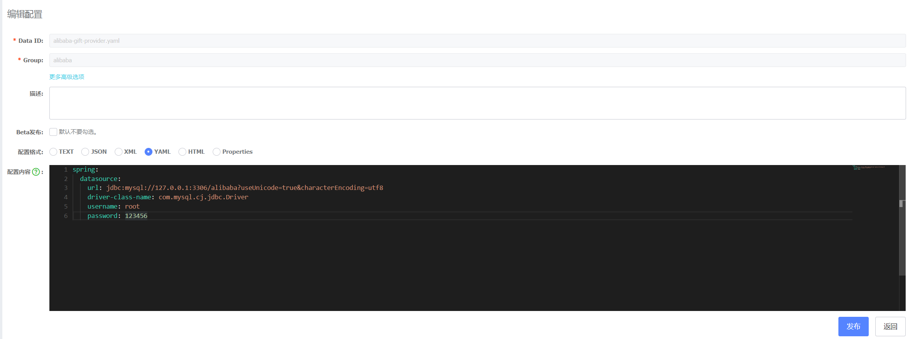
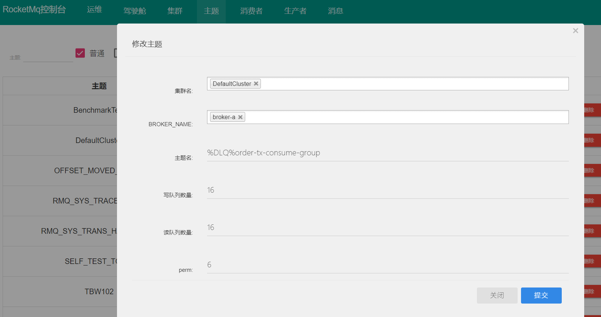

> LOGO制作网站：http://www.uugai.com/

本项目包含SpringCloud和SrpingCloudDubbo

* master分支 SpringCloud
* dubbo分支 SpringCloudDubbo
* dev分支 SpringCloud最新开发分支
* dev-lcn分支 废弃

### 开发规范

SpringCloud架构开发规范

* 模块之间不能存在任何依赖 比如User模块不能依赖Live
* 模块之间使用feign调用服务返回的对象需要自己定义可以cory提供者的类
* 请求使用request对象 返回使用dto对象 请严格遵循

### 模块介绍

| 模块  | 描述 |端口|
|---|---|---|
| alibaba-gateway  |  服务入口层       | 8080  |
| alibaba-user      | 用户服务      | 8083  |
| alibaba-user-api  | 用户服务Api   | 无    |
| alibaba-gift      |  礼物服务     | 8081  |
| alibaba-gift-api  | 礼物服务Api   | 无    |
| alibaba-live      | 直播服务      | 8082  |
| alibaba-live-api  |  直播服务Api  | 无    |
| alibaba-spring-cloud-wii  |  异构服务调用  | 8070 |

### 使用介绍

本架构使用gateway作为服务统一入口 访问接口统一带上/api

why gateway ? 生产全部服务应该是内网的 所以需要nginx将gateway挂载出去实现统一的入口

### 框架技术

* MybatisPlus
* SpringBoot
* SpringCloud
* SpringCloudAlibaba
* Nacos (注册中心兼配置中心)
* Mysql
* Seata
* Wii (解决通过Spring Cloud调用非Spring Cloud项目 源码地址：https://gitee.com/itmuch/spring-cloud-wii)

### 工具

* Lombok
* 【IDEA插件】MyBatisCodeHelperPro(mybatis plus generator)
* docker-compose(服务编排暂未做实现)
* 【IDEA插件】YapiUpload(注释生成yapi文档)
* yapi [crazy-api个性化定制](https://github.com/xian-crazy/yapi)
* 【IDEA插件】MapStruct Support(字段映射跳转)

### nacos配置中心介绍

spring.profiles.active=dev的话默认读取${spring.application.name}.${file-extension}和${spring.application.name}-${spring.profiles.active}.${file-extension}

刷新配置操作：在需要刷新的类中添加@RefreshScope 或者 spring.cloud.refresh.enabled=true (默认不需要配置)

* dataId 对应 ${spring.application.name}-${spring.profiles.active}.${file-extension}
* groupId 代码中配置对应就行
* 内容

```java
spring:
  datasource:
    url: jdbc:mysql://127.0.0.1:3306/alibaba?useUnicode=true&characterEncoding=utf8
    driver-class-name: com.mysql.cj.jdbc.Driver
    username: root
    password: 123456
```



#### 配置的优先级

Spring Cloud Alibaba Nacos Config 目前提供了三种配置能力从 Nacos 拉取相关的配置。

* A: 通过 spring.cloud.nacos.config.shared-dataids 支持多个共享 Data Id 的配置

```java
spring.cloud.nacos.config.shared-dataids=bootstrap-common.properties,all-common.properties
spring.cloud.nacos.config.refreshable-dataids=bootstrap-common.properties
```

* B: 通过 spring.cloud.nacos.config.ext-config[n].data-id 的方式支持多个扩展 Data Id 的配置

```
Data Id 既不在默认的组，也支持动态刷新
spring.cloud.nacos.config.ext-config[0].data-id=ext-config-common03.properties
spring.cloud.nacos.config.ext-config[0].group=REFRESH_GROUP
spring.cloud.nacos.config.ext-config[0].refresh=true
```

* C: 通过内部相关规则(应用名、应用名+ Profile )自动生成相关的 Data Id 配置

```java
${spring.application.name}-${profile}.${file-extension:properties}
```

当三种方式共同使用时，他们的一个优先级关系是:A < B < C

### yapi文档

使用YapiUpload(该项目需要使用多模块配置)插件根据规范的javadoc注释生成文档

YapiUpload配置例子(.idea->misc.xml)：

```
<component name="yapi">
  <option name="moduleList">moduleName1,moduleName2</option>
</component>

<component name="moduleName1">
  <option name="moduleName1.Token">yapi中项目token</option>
  <option name="moduleName1.Id">yapi中项目id</option>
  <option name="moduleName1.Url">http://127.0.0.1:3000</option>
  <option name="moduleName1.Type">api</option>
  <option name="moduleName1.AttachUploadUrl">http://localhost/fileupload</option>
</component>
```

工具使用参考我的博客(可以设置方法注释模板)

类级别分类注释

```java
/**
 * @NAME UserController
 * @USER Ciwei
 * @DATE 2019/8/26/026 11:02
 * @menu 礼物服务接口
 **/
```

方法级别注释：

```java
/**
 * @author 如果没有你
 * @date 2019/8/29 16:01
 * @description 查询所有用户
 * @param alibabaUser: 用户查询条件
 * @return {@link ResponseMessage< List< AlibabaUser>>}
 **/
```

### 动态路由

根据Spring Cloud alibaba Nacos Config的动态刷新特性自动刷新Bean和配置

首先会读取Nacos配置中心配置的dataId为alibaba-gateway-consumer.yaml的配置规则

如果没有读取到会读取本地application.yml的配置规则 都存在的话Nacos配置中心的配置会覆盖本地的配置

[Nacos配置参考](alibaba-gateway/README.md)

### 动态数据源

和动态路由原理一样 只需要在Nacos配置中心配置 更新配置会自动刷新bean和配置

### 协同开发

开发中可能会遇到公用一个注册中心 那么服务就会混乱 所以添加了版本控制各自使用自己的版本开发

应用服务网关都需要添加注解 依赖 版本

添加注解：

```java
@EnableServerVersionRule
```

添加starter依赖：

```
<dependency>
    <groupId>com.ciwei</groupId>
    <artifactId>alibaba-ribbon-spring-boot-starter</artifactId>
</dependency>
```

添加版本和集群：

```yaml
spring:
  cloud:
    nacos:
      discovery:
        cluster-name: Alibaba
        metadata:
          version: 0.1
          target-version: 0.1
```

是否开启版本配置：

在nacos配置中心添加(动态配置有三种方式选一种就行了)：

```
dataId: alibaba-common.properties
group: alibaba
ribbon.is-cluster-version.enabled=true
```

对应服务配置文件bootstrap.yml添加：

```
# 自定义扩展的dataId配置
ext-config:
  - data-id: alibaba-common.properties
    group: alibaba
    refresh: true
```

#### 测试

有三个比较重要的参数：cluster-name: Alibaba ，version: 0.1 ，target-version: 0.1

* 负载均衡规则：优先选择同集群下，符合metadata的实例
* 如果没有，就选择所有集群下，符合metadata的实例

如果不存在target-version那么会使用cluster-name下所有实例的默认规则

如果cluster-name也不存在那么会使用默认的负载均衡规则(轮询)

isClusterVersion=false 使用默认的负载均衡规则(轮询)

#### 多人开发

生产上线配置中心可以不配置isClusterVersion=false使用默认的负载均衡策略

配置自己的服务版本和使用版本：version: 0.1 ，target-version: 0.1 当然也可以配置集群：cluster-name: Alibaba

### 分布式事务seata(同步场景)

使用：[分布式事务seata](alibaba-seata/README.md)

配置参考：

[安装使用参考基于seata0.8.1nacos1.1.3](alibaba-seata/springcloud-nacos-seata.md)

参考：

* Spring Cloud Alibaba Seata 快速集成 https://github.com/seata/seata-samples/blob/master/doc/quick-integration-with-spring-cloud.md

* Spring Cloud Alibaba Nacos Seata 快速集成 https://github.com/seata/seata-samples/blob/master/springcloud-nacos-seata/README.md

### 分布式事务rocketmq(异步场景)

安装rocketmq参考：[安装rocketmq](alibaba-rocketmq-transactional/ROCKETMQ.md)

死信队列需要手动创建 并且perm修改成6 如果为2的话代码中无法消费 

代码中消费以%DLQ%开头的topic：%DLQ%${spring.cloud.stream.bindings.input.group}

alibaba-rocketmq-transactional模块是集成项目前的一个例子提供参考学习

多个input和output需要使用不同topic不然会出现一次消费所有监听这个topic的都会执行一次(会出现重复消费的问题)

topic需要手动在界面上创建或者配置文件开启自动创建autoCreateTopicEnable=true

* demo为具体使用rocketmq简单的例子
* demo2为配置多个生产者和消费者例子

### Spring Cloud Wii

异构微服务框架(可选) 主要解决使用微服务后调用以前项目的接口 需要也通过Nacos注册中心调用的

解决通过Spring Cloud调用非Spring Cloud项目

源码地址：https://gitee.com/itmuch/spring-cloud-wii

### 异常通知

此功能为了排查生产的异常信息

> 集成：

prometheus-spring-boot-starter源码集成到alibaba-prometheus-spring-boot-starter

> 源码地址：https://gitee.com/ITEater/prometheus-spring-boot-starter

```xml
<!--异常通知-->
<dependency>
    <groupId>com.ciwei</groupId>
    <artifactId>alibaba-prometheus-spring-boot-starter</artifactId>
</dependency>

<!--邮件-->
<dependency>
    <groupId>org.springframework.boot</groupId>
    <artifactId>spring-boot-starter-mail</artifactId>
</dependency>
```

nacos配置(如果不配置默认是关闭的)：

```yaml
dataId: alibaba-common.yaml
group: DEFAULT_GROUP
配置内容：
spring:
  mail:
    host: smtp.163.com
    port: 25
    username: 开启smtp权限的邮箱用户名
    password: 密码(授权码)
exceptionnotice:
#  dinding:
#    phone-num: 钉钉注册时的手机号
#    web-hook: 设置的钉钉机器人的web-hook
  email:
    to: 给谁发
    cc: 抄送谁
    bcc: 秘密抄送谁
# 追踪信息的包含的包名，配置之后只通知此包下的异常信息
  included-trace-package: com.wei
  notice-type: email
  listen-type: web_mvc
  open-notice: true
  exclude-exceptions:
  # 需要排除的异常通知，注意 这里是异常类的全路径，可多选
    - com.ciwei.common.utils.BusinessException
```